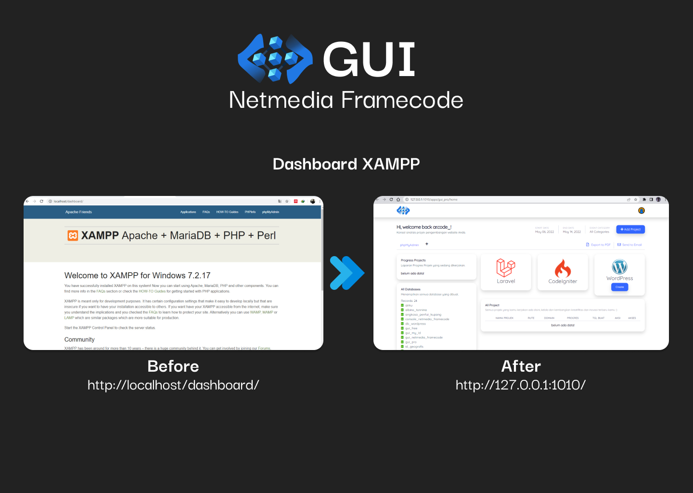

# gui_free
<h1>GUI - Netmedia Framecode for Personal</h1>

<h3>Apa itu GUI?</h3>
Graphical user interface (GUI) adalah sistem komponen visual interaktif untuk software komputer. Menurut Computer Hope, GUI menampilkan objek yang bisa menyampaikan informasi dan merepresentasikan aksi dari pengguna. Dengan adanya GUI, kita bisa mengetahui bahwa apa yang kita input telah diterima dan responsnya ditunjukkan secara visual. GUI bisa terlihat dari perubahan warna, ukuran, visibilitas, dan sejenisnya ketika terjadi sebuah interaksi. Awalnya, GUI dikembangkan di tahun 1970 akhir oleh Xerox Palo Alto. Setelah berhasil, sistem ini digunakan oleh Apple untuk Macintosh-nya dan juga sistem operasi Windows yang dimiliki oleh Microsoft. Ditemukannya GUI memberikan solusi bagi permasalahan respon yang dirasakan oleh pengguna. Saat ini, kamu bisa menemukan aplikasi dari sistem GUI pada tombol, scroll bar, tab, menu, kursor, dan masih banyak lagi di berbagai perangkat yang ada. Tentunya, tampilannya semakin modern dan selalu mengikuti perkembangan zaman. Dan saat ini kamu juga sudah bisa menggunakan GUI di peramban web dari server Netmedia Framecode dan terinstal di laptop kamu secara local server yang berarti GUI ini bisa kamu gunakan tanpa internet.

<h3>Bagaimana cara menggunakannya?</h3>
untuk cara menggunakan GUI ini kamu bisa melihatnya <a href="https://gui.my.id" target="_blank">disini</a>.

Jika kamu ingin menghubungi developer kamu bisa mengirim pesan melalui kontak berikut:  
e-Mail: arlanbutarbutar@net-code.tech  
WhatsApp: +62 811 3827 421  
Instagram: @ar.code_

Terima kasih